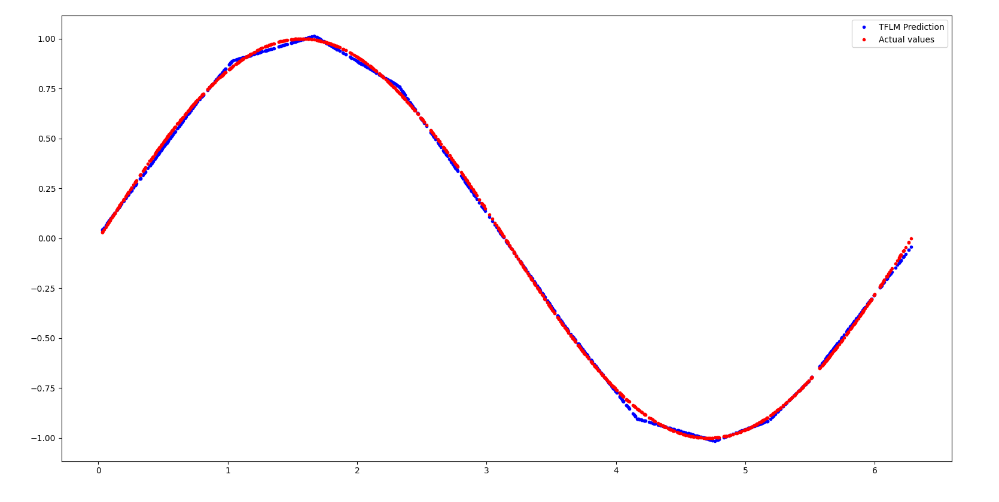

# hello-word-rebuild


```
some shit with wrong hash on docker ???
vi +751 ./third_party/python_requirements.txt
    --hash=sha256:8339777b1b5ebd8ffadaa8196f786e65fbb081a371d8e87b52f24563392d8552
```

## ref code

```
tensorflow/lite/micro/examples/hello_world
===========================================
|-- BUILD
|-- Makefile.inc
|-- README.md
|-- evaluate.py
|-- evaluate_test.py
|-- hello_world_test.cc
|-- images
|   |-- hello_world_tflite.png
|   `-- hello_world_tflm.png
|-- models
|   |-- BUILD
|   |-- hello_world_float.tflite
|   `-- hello_world_int8.tflite
|-- quantization
|   |-- BUILD
|   `-- ptq.py
`-- train.py

```


## 1.train 

build train

> bazel build tensorflow/lite/micro/examples/hello_world:train

```
will create:

bazel-bin/tensorflow/lite/micro/examples/hello_world/
====================================================
|-- train
|-- train.repo_mapping
|-- train.runfiles
`-- train.runfiles_manifest

```

run train

> bazel-bin/tensorflow/lite/micro/examples/hello_world/train  --save_tf_model --save_dir=tensorflow/lite/micro/examples/hello_world/models2

```

...

13/13 - 0s - 3ms/step - loss: 7.6274e-04 - mae: 0.0196 - val_loss: 6.9412e-04 - val_mae: 0.0200
Epoch 497/500
13/13 - 0s - 5ms/step - loss: 0.0010 - mae: 0.0233 - val_loss: 6.9317e-04 - val_mae: 0.0189
Epoch 498/500
...


tensorflow/lite/micro/examples/hello_world/models2
==================================================
    30K   saved_model.h5
    3.1K  hello_world_float.tflite

```

result with a float model - take floating point input and can produce floating point output.


### quantize


> bazel build tensorflow/lite/micro/examples/hello_world/quantization:ptq

bazel-bin/tensorflow/lite/micro/examples/hello_world/quantization/ptq --source_model_dir=/home/user/tflite-micro/tensorflow/lite/micro/examples/hello_world/models2 --target_dir=/home/user/tflite-micro/tensorflow/lite/micro/examples/hello_world/models2

```
TBD

```


## 2.1 evaluate

* evaluate.py script runs the hello_world.tflite model with x_values in the range of [0, 2*PI]

* plots a diagram of the predicted value of sinwave using TFLM interpreter and compare that prediction with the actual value generated by the numpy lib

??? missing the : tensorflow/lite/micro/examples/hello_world/models/BUILD ; needed for next stage ???

> bazel build tensorflow/lite/micro/examples/hello_world:evaluate
> bazel run tensorflow/lite/micro/examples/hello_world:evaluate



## 2.2 evaluate_test

* verify the input/output as well as the prediction of the hello_world.tflite model
* verify the correctness of the model by running both TFLM and TFlite interpreter and then comparing the prediction from both interpreters

> bazel build tensorflow/lite/micro/examples/hello_world:evaluate_test
> bazel run tensorflow/lite/micro/examples/hello_world:evaluate_test

```
Number of resource variables the model uses =  0
INFO:tensorflow:time(__main__.HelloWorldFloatModelTest.test_compare_with_tflite): 0.05s
I0926 11:34:08.734003 139654847885952 test_util.py:2634] time(__main__.HelloWorldFloatModelTest.test_compare_with_tflite): 0.05s
[       OK ] HelloWorldFloatModelTest.test_compare_with_tflite
[ RUN      ] HelloWorldFloatModelTest.test_session
[  SKIPPED ] HelloWorldFloatModelTest.test_session
[ RUN      ] HelloWorldQuantModelTest.test_compare_with_tflite
Number of resource variables the model uses =  0
INFO:tensorflow:time(__main__.HelloWorldQuantModelTest.test_compare_with_tflite): 0.02s
I0926 11:34:08.757249 139654847885952 test_util.py:2634] time(__main__.HelloWorldQuantModelTest.test_compare_with_tflite): 0.02s
[       OK ] HelloWorldQuantModelTest.test_compare_with_tflite
[ RUN      ] HelloWorldQuantModelTest.test_session
[  SKIPPED ] HelloWorldQuantModelTest.test_session
```


### 3. build C app

* run  hello_world_test.cc c tests
* https://ai.google.dev/edge/litert/microcontrollers/get_started#run_inference

```
TF_LITE_ENSURE_STATUS(ProfileMemoryAndLatency());
  TF_LITE_ENSURE_STATUS(LoadFloatModelAndPerformInference());
  TF_LITE_ENSURE_STATUS(LoadQuantModelAndPerformInference());
```

* creates an interpreter, gets a handle to a model that's been compiled into the program, and then invokes the interpreter with the model and sample inputs.

> bazel run tensorflow/lite/micro/examples/hello_world:hello_world_test

```

[RecordingMicroAllocator] 'TfLiteEvalTensor data' used 240 bytes with alignment overhead (requested 240 bytes for 10 allocations)
[RecordingMicroAllocator] 'Persistent TfLiteTensor data' used 224 bytes with alignment overhead (requested 224 bytes for 2 tensors)
[RecordingMicroAllocator] 'Persistent buffer data' used 1144 bytes with alignment overhead (requested 1100 bytes for 7 allocations)
[RecordingMicroAllocator] 'NodeAndRegistration struct' used 264 bytes with alignment overhead (requested 264 bytes for 3 NodeAndRegistration structs)
~~~ALL TESTS PASSED~~~


```

build and run

> make -f tensorflow/lite/micro/tools/make/Makefile test_hello_world_test

* using https://pigweed.dev/


```
tensorflow/lite/micro/tools/make/test_latency_log.sh hello_world_test  gen/linux_x86_64_default_gcc/bin/hello_world_test '~~~ALL TESTS PASSED~~~' linux

"Unique Tag","Total ticks across all events with that tag."
FULLY_CONNECTED, 2
"total number of ticks", 2

[RecordingMicroAllocator] Arena allocation total 2344 bytes
[RecordingMicroAllocator] Arena allocation head 128 bytes
[RecordingMicroAllocator] Arena allocation tail 2216 bytes
[RecordingMicroAllocator] 'TfLiteEvalTensor data' used 240 bytes with alignment overhead (requested 240 bytes for 10 allocations)
[RecordingMicroAllocator] 'Persistent TfLiteTensor data' used 128 bytes with alignment overhead (requested 128 bytes for 2 tensors)
[RecordingMicroAllocator] 'Persistent buffer data' used 1152 bytes with alignment overhead (requested 1100 bytes for 7 allocations)
[RecordingMicroAllocator] 'NodeAndRegistration struct' used 192 bytes with alignment overhead (requested 192 bytes for 3 NodeAndRegistration structs)
~~~ALL TESTS PASSED~~~

```

will build:

```
./gen/linux_x86_64_default_gcc/bin/hello_world_test
==================================================


"Unique Tag","Total ticks across all events with that tag."
FULLY_CONNECTED, 9
"total number of ticks", 9

[RecordingMicroAllocator] Arena allocation total 2344 bytes
[RecordingMicroAllocator] Arena allocation head 128 bytes
[RecordingMicroAllocator] Arena allocation tail 2216 bytes
[RecordingMicroAllocator] 'TfLiteEvalTensor data' used 240 bytes with alignment overhead (requested 240 bytes for 10 allocations)
[RecordingMicroAllocator] 'Persistent TfLiteTensor data' used 128 bytes with alignment overhead (requested 128 bytes for 2 tensors)
[RecordingMicroAllocator] 'Persistent buffer data' used 1152 bytes with alignment overhead (requested 1100 bytes for 7 allocations)
[RecordingMicroAllocator] 'NodeAndRegistration struct' used 192 bytes with alignment overhead (requested 192 bytes for 3 NodeAndRegistration structs)
~~~ALL TESTS PASSED~~~


```

