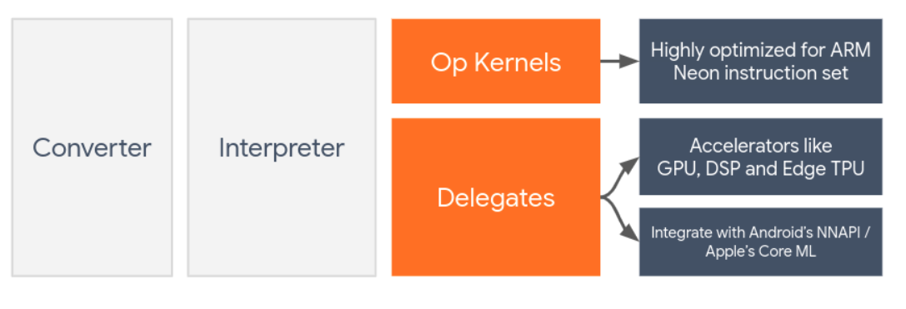

# hw acceleration /  LiteRT Delegates

By default, LiteRT utilizes CPU kernels that are optimized for the ARM Neon instruction set

each delegate has a pre-defined set of operations it supports

Delegates usually perform computations at a different precision than their CPU counterparts.

LiteRT has two types of tooling to measure how accurately a delegate behaves for a given model: Task-Based and Task-Agnostic.